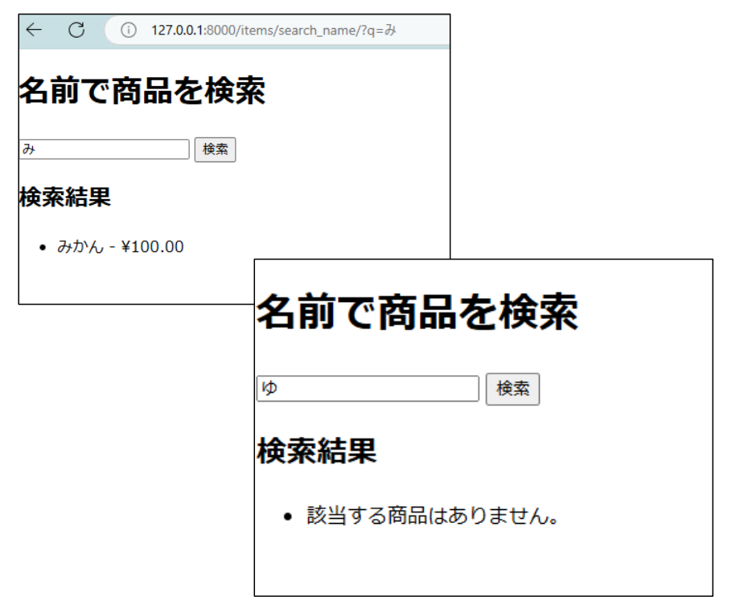
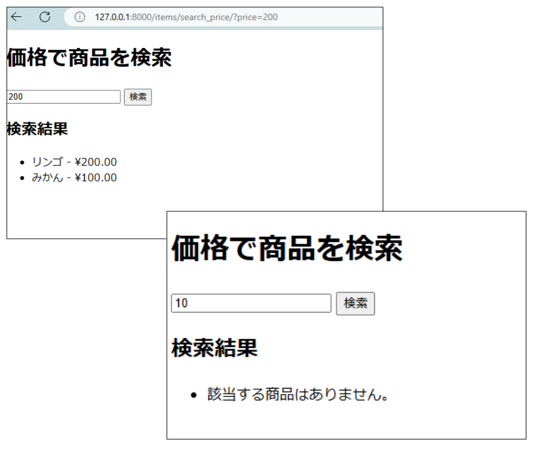
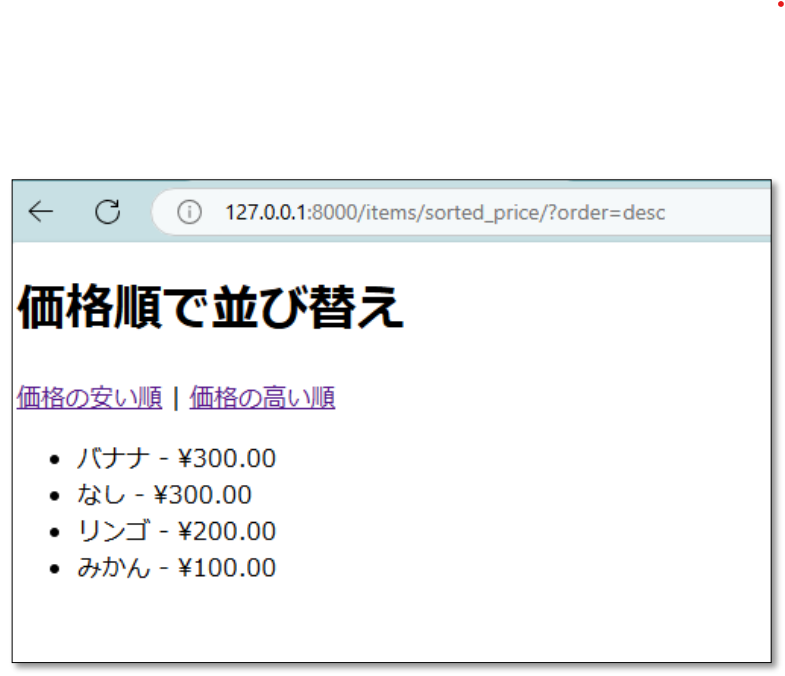
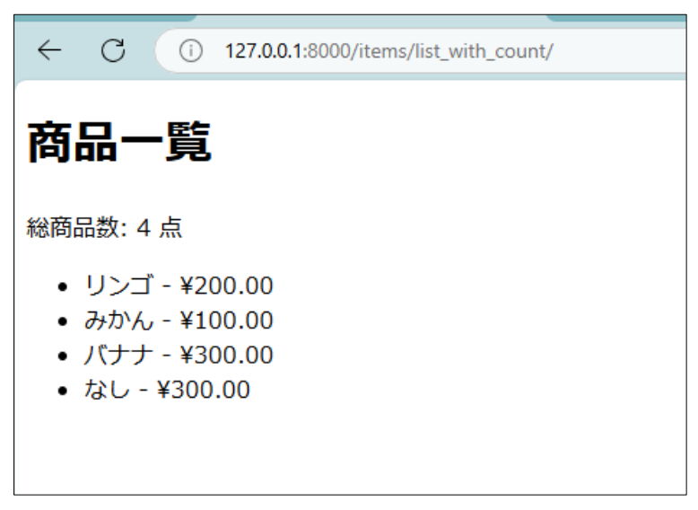
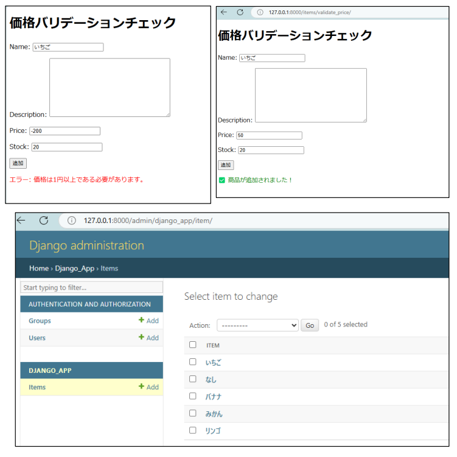
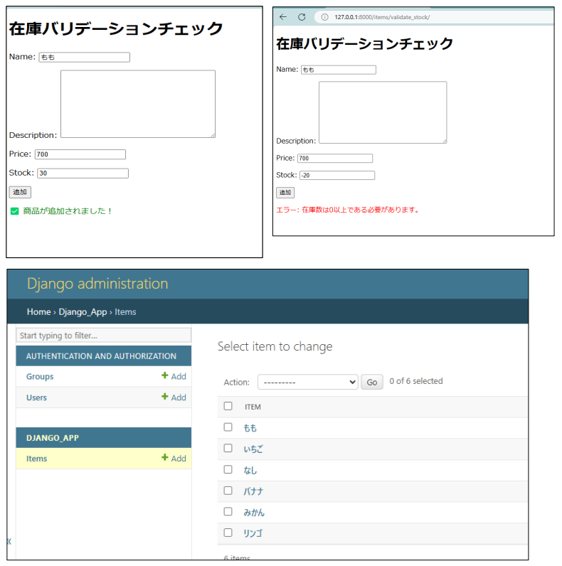

# Django

# 練習問題

# 【基礎】


- 1 Djangoのプログラムを作ろう
- 2 Webページの基本を覚えよう
- 3 テンプレートを利用しよう
- 4 フォームで送信しよう.............................................................................................................................
- 5 さまざまなフィールド.............................................................................................................................
- 6 セッションとミドルウェア
- 7 管理ツールでデータベースを作ろう
- 8 管理ツールを使おう
- 9 レコード取得の基本とManager
- 10 CRUDを作ろう
- 11 検索をマスターしよう...........................................................................................................................
- 12 データベースを更に極める
- 13 バリデーションを使いこなそう


## 1 Djangoのプログラムを作ろう

```
Question 1_1 基礎
以下の仕様を満たすDjangoのプロジェクトを作成してください。
```
- 内容：
    ➀ プロジェクト名: django_app
    ➁ フォルダ名：myproject
実行結果：

```
Question 1_ 2 基礎
Question1_1で作成したアプリケーションを実行し、ブラウザでアクセスしてください
```
```
URL：http://localhost:8000/
```
```
実行結果：
```

## 2 Webページの基本を覚えよう

```
Question 2 _1 基礎
以下の仕様を満たすDjangoのアプリケーションを作成してください。
```
```
➀ 以下のURLにアクセスした時、『hello World』と表示させてください。
関数を「views.py」に作成し、以下のURLにアクセスをしたら実行されるように「urls.py」に
処理を追記してください。関数名は任意の名前で作成してください。
```
```
http://localhost:8000/hello
```
```
実行結果：
```

```
Question 2 _ 2 基礎
以下の仕様を満たすDjangoのアプリケーションを作成してください。
```
➀以下のURLにアクセスしたとき、「こんにちは、hanako tanaka」と表示される関数を
「views.py」に作成してください。ただし、hanakoとtanakaの値はパラメータとして送る値と
します。

```
【手順】
・urlpatterns.pyを修正し、値を 2 つ指定できるpathを追加する
・views.pyに、 2 つのパラメータの値を扱う引数を指定した関数を作成する。関数名は
任意の名前で作成してください。
```
```
http://localhost:8000/hello/tanaka/hanako
```
### 実行結果：


## 3 テンプレートを利用しよう

```
Question 3 _1 基礎
以下の仕様を満たす、テンプレート用のファイルを作成してください。
```
```
➀ 配置場所：myproject配下
➁ フォルダ名：templates ※上記の配下に以下を作成
➀ フォルダ名：django_app
➁ ファイル名：index.html
```
```
実行結果：
```
```
Question 3 _ 2 基礎
以下の仕様を満たす、Djangoのプログラムを作成してください。
```
```
➀ 3_1で作成したテンプレートファイルに「Hello！」と表示するHTMLを作成し
以下のURLからアクセスできるようにしてください。
```
```
http://localhost:8000/hello/index/
```

## 4 フォームで送信しよう.............................................................................................................................

```
Question 4 _1 基礎
以下の仕様を満たす、Djangoのプログラムを作成してください。
```
```
【手順】
➀ Templates配下のdjango_app内に以下の情報を入力して送信する
form.htmlを作成
・名前（text）
・年齢（number）
・性別（男女の選択が可）
・送信ボタン
```
```
➁ 以下のURLにアクセスすると、作成したform.htmlが表示される
プログラムを作成する。
```
```
(1)関数を「views.py」に作成する。※関数名は任意の名前で良い
(2)「urls.py」に以下のURLで表示させるpathを追記する
```
```
http://localhost:8000/hello/form/
```
### 実行結果：


Question 4 _ 2 基礎
以下の仕様を満たす、Djangoのプログラムを作成してください。4_1にて実際に入力された内
容がユーザー情報の下に表示されるようなプログラムを作成してください。

### 【手順】

```
➀ 4_1で作成した関数に、request.methodを使ってGETとPOST処理とで
処理を分岐させるようにプログラムを作成する。
この時、POST送信の場合の処理は送信時に実行される処理を記述する。
```
```
➁ URLは4_1と同様のURLとします。
```
```
http://localhost:8000/hello/form/
```
### 実行結果：


## 5 さまざまなフィールド.............................................................................................................................

```
Question 5 _1 基礎
以下の仕様を満たす、Djangoのプログラムを作成してください。
以下のフィールドの種類すべてを含むHTMLを作成し、
アクセスすると表示、送信ボタンを押下すると情報を確認できるようにしてください。
```
```
【手順】
① Templates配下のdjango_app内に以下の情報を入力して送信する
fieldtype_1.htmlを作成する。
```
```
・名前（テキスト入力）
・年齢（数値入力）
・性別（ドロップダウン）
・メールアドレス（メールアドレス）
・パスワード（パスワード）
```
```
② 以下のURLにアクセスをすると、作成したfieldtype_1.htmlが表示されるように関
数やpathの設定を「views.py」と「urls.py」に追記する。※関数名は任意の名前で
良い。
```
```
http://localhost:8000/hello/field1/
```

### 実行結果：


```
Question 5 _ 2 基礎
```
以下の仕様を満たす、Djangoのプログラムを作成してください。

```
【手順】
① Templates配下のdjango_app内に以下の情報を入力して送信する
fieldtype_ 2 .htmlを作成する。
```
```
・趣味（チェックボックス(読書、スポーツ、音楽）
・好きな色：（ラジオボタン[赤、青、緑]）
・誕生日（日付選択）
```
```
② 以下のURLにアクセスをすると、作成したfieldtype_ 2 .htmlが表示されるように関
数やpathの設定を「views.py」と「urls.py」に追記する。※関数名は任意の名前で
良い。
```
```
http://localhost:8000/hello/field 2 /
```
### 実行結果：


## 6 セッションとミドルウェア

- Question 6 _1 基礎
    以下の内容を満たすページを作成してください。

```
【手順】
➀ Templates配下のdjango_app内にproducts_cart.htmlを作成し、
表示する関数を「views.py」に追記する。pathの設定も手順下のURLで実行する
ように設定に追記する。
※関数名は任意の名前で良い。
➁ 画面上に商品の文字列（りんご、みかん、バナナ）を表示させる。
➂ ②の商品の下にカートへ追加ボタンを設置する。
➃ セッションを利用し、ボタン押下すると、押下した商品は画面下のカートに
表示されるように「views.py」に処理を追記する。
※このときページ切り替え後もカート内の値が保持されていることを確認する。
```
```
http://localhost:8000/hello/products_cart/
```
### 実行結果：


Question 6 _ 2 基礎
ミドルウェアを用いて、ボタンが押下されたときにコンソールに商品名を表示するようなプ
ログラムを作成してください。

```
実行結果：
```

## 7 管理ツールでデータベースを作ろう

```
Question 7 _1 基礎
データベースを作るにあたって、以下設定を記述してください。
データベースはPostgreSQLを用います。
PostgreSQL に接続しデータベースを作成してください。
```
```
・データベース名：items
※Setting.py内のデータベース設定を編集してください。
```
実行結果：


Question 7 _ 2 基礎
モデルクラスを作ります。
以下の仕様を満たすitemクラスを「models.py」に設定してください。
※admin.pyも設定する必要があります。
また、マイグレーションを実行してください。

- 内容：
    ➀ アイテム名(name)：CharField(max_length=255)
       説明(description)：TextField(blank=True, null=True)
       価格(price)：DecimalField(max_digits=10, decimal_places=2)
       在庫数(stock)：models.IntegerField()

```
➁ クラス名：item
```
### 実行結果


## 8 管理ツールを使おう

Question 8 _1 基礎
管理ツールにアクセスし、itemsテーブルがある事を確認してください。
※スーパーユーザーを作成する必要があります。

```
【作成方法】
➀ターミナルから「python manage.py createsuperuser」を実行する
➁管理者情報を訪ねてくるため、管理者名(admin)、メールアドレス(sample@gmail.com)、PW(
文字以上)、PW確認を入力する
```
```
実行結果：
```

Question 8 _ 2 基礎
管理ツールから、レコードを 3 つ作成してください。

```
内容：
➀名前：リンゴ 値段： 200 在庫： 100
➁名前：みかん 値段： 100 在庫： 200
➂名前：バナナ 値段： 300 在庫： 50
```
```
実行結果：
```

## 9 レコード取得の基本とManager

```
Question 9 _1 基礎
以下の仕様を満たすDjangoプログラムを作成してください。
```
```
【手順】
➀ Templates配下のdjango_app内に商品を一覧で表示するitem_list.htmlを
作成する。
➁ itemsテーブルの全商品を取得する処理と、①で作成したHTMLに全商品の
情報を渡す処理を記載した関数を「views.py」に追記する。
pathの設定も手順下のURLで実行するように設定ファイルに追記する。
※関数名は任意の名前で良い。
➂ itemsテーブルの全商品を表示するように、item_list.htmlを編集する。
```
```
http://localhost:8000/items
```
### 実行結果：


Question 9 _ 2 基礎
以下の仕様を満たすDjangoプログラムを作成してください。
itemsテーブルで追加された商品の中で、価格が 100 円のものだけを表示する。
URLは以下とする。

```
http://localhost:8000/items/price
```
### 実行結果：


## 10 CRUDを作ろう

```
Question 10 _1 基礎
以下の仕様を満たすDjangoプログラムを作成してください。
```
- 内容: アイテム管理ページ
① 保存用のフォームを作成する
    ModelForm を使って、Itemモデルに対応するフォーム「forms.py」を作成
    【表示・処理するフィールド】
    ・Name（名前）
    ・Description（説明）
    ・Price（値段）
    ・stock（在庫）

```
② 商品の名前、説明、値段、在庫を追加するフォームと、商品リストと削除ボタンを表示す
るitem_list_add_edit.htmlを作成する。
```
- 追加ボタンを押下すると、画面下に表示されている商品リストに追加される
- 商品が無い場合は、商品リストに「商品がありません。」と表示される
- 商品リストの削除ボタンを押下すると、商品が削除される

```
③ アイテム一覧＋アイテム追加＋削除を 1 つの画面で管理する関数を「views.py」に追記す
る。
pathの設定も手順下のURLで実行するように設定ファイルに追記する。
※関数名は任意の名前で良い
```
```
http://localhost:8000/items/manage
```

### 実行結果：


Question 10 _ 2 基礎
以下の仕様を満たすDjangoのプログラムを作成してください。

- 内容: アイテム編集ページ
    ① アイテム一覧を表示し、編集ページに遷移するitem_edit_list.htmlを作成する。
       - 商品リストを表示し、編集ページに遷移するリンクをリスト横に配置
       - 編集リンクを押下すると、編集ページに遷移しアイテムの変更が可能になる
       ＊ページ遷移の必要があるため、idを取得し、それに対応する名前や値段などを取得する
② アイテム編集ができるedit_item.htmlを作成する。
- 保存ボタン押下で編集を確定する
    ③ 商品一覧と編集ボタンを表示する関数と、商品の編集を行う関数を「views.py」に追記す
       る。pathの設定も手順下のURLで実行するように設定ファイルに追記する。
          ※関数名は任意の名前で良い

```
http://localhost:8000/items/edit
```
### 実行結果：


## 11 検索をマスターしよう...........................................................................................................................

```
Question 11 _1 基礎
以下の仕様を満たすDjangoプログラムを作成してください。
```
- 内容:
    ➀ 名前で商品を検索し、検索結果を表示するsearch_item_by_name.htmlを作成する。
       - 該当する商品(※部分一致でも可)があれば表示
       - 検索結果が無い場合は「該当する商品はありません。」と表示
    ② 商品を名前で検索する関数を「views.py」に追記する。pathの設定も手順下のURLで実行
       するように設定ファイルに追記する。
          ※関数名は任意の名前で良い

```
http://localhost:8000/items/search_name
```
### 実行結果：



```
Question 11 _ 2 基礎
以下の仕様を満たすDjangoプログラムを作成してください。
```
- 内容: 商品の価格で検索するページ
    ➀ 価格で商品を検索し、検索結果を表示するsearch_item_by_price.htmlを作成する
       - 検索結果が無い場合は「該当する商品はありません。」と表示
    ➁ 商品を名前で検索する関数を「views.py」に追記する。pathの設定も手順下のURLで実
       行するように設定ファイルに追記する。
          ※関数名は任意の名前で良い

```
http://localhost:8000/items/search_price
```
### 実行結果：



## 12 データベースを更に極める

```
Question 12 _1 基礎
以下の仕様を満たすDjangoプログラムを作成してください。
```
- 内容: 商品の価格を安い順・高い順に並び替えるページを作成してください。

```
➀ 商品の価格を安い順・高い順に並び替えできるsorted_items_by_price.htmlを作成する。
➁ 商品を検索し並び変えをする関数を「views.py」に追記する。
pathの設定も手順下のURLで実行するように設定ファイルに追記する。
※関数名は任意の名前で良い
```
```
http://localhost:8000/items/sorted_price
```
### 実行結果：



Question 12 _ 2 基礎
以下の仕様を満たすDjangoプログラムを作成してください。

- 内容: 商品一覧の上に、総商品数を表示するページを作成してください。

```
➀ 商品一覧の上に、総商品数をカウントし表示するitem_list_with_count.htmlを作成する。
➁ 商品一覧と総数を表示する関数を「views.py」に追記する。
pathの設定も手順下のURLで実行するように設定ファイルに追記する。
※関数名は任意の名前で良い
```
```
http://localhost:8000/items/list_with_count
```
### 実行結果：



## 13 バリデーションを使いこなそう

Question 13 _1 基礎
以下の仕様を満たすDjangoプログラムを作成してください。

- 内容: 価格が負の値の時、エラーを発生させる。
    ➀ 商品の追加（item_list_add_edit.html）と同様の入力項目をもつ価格バリデーションチェ
       ックを行うvalidate_price.htmlを作成する。
    ➁ 追加ボタンを押下時、価格が負の値かを確認するバリデーションをmodel.pyに
       追記する
    ③ 価格バリデーションをチェックし、商品を追加する関数を「views.py」に追記する。
       pathの設定も手順下のURLで実行するように設定ファイルに追記する。
          ※関数名は任意の名前で良い
- 負の値の時は、
「エラー: 価格は 1 円以上である必要があります」というエラーを表示させる。
- 問題がなければデータベースに商品を追加する。

```
http://localhost:8000/items/ validate_price
```

### • 実行結果:



Question 13 _ 2 基礎
以下の仕様を満たすDjangoプログラムを作成してください。

- 内容: 在庫が負の値の時、エラーを発生させる。
    ➀ 商品の追加（item_list_add_edit.html）と同様の入力項目をもつ価格バリデーションチェ
       ックを行うvalidate_stock.htmlを作成する。
    ➁ 追加ボタンを押下時、在庫が負の値かを確認するバリデーションをmodel.pyに
       追記する
    ④ 在庫バリデーションをチェックし、商品を追加する関数を「views.py」に追記する。
       pathの設定も手順下のURLで実行するように設定ファイルに追記する。
          ※関数名は任意の名前で良い
- 負の値の時は、
「エラー: 在庫は 0 以上である必要があります」というエラーを表示させる。
- 問題がなければデータベースに商品を追加する。

```
http://localhost:8000/items/ validate_stok
```

### 実行結果：

